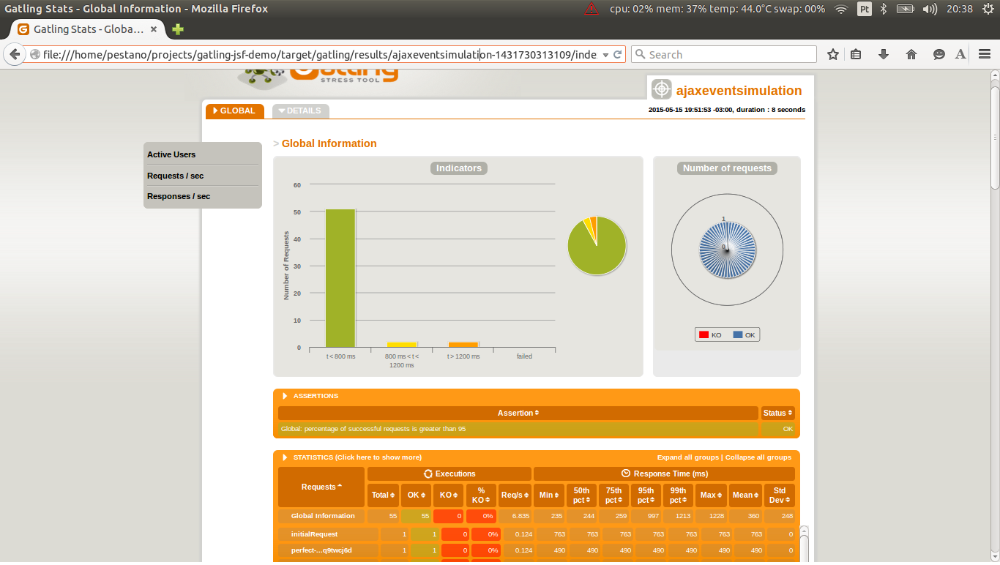

= Gatling JSF demo

This sample app just shows how to execute JSF requests through http://gatling.io/#/[Gatling stress tool] against http://www.primefaces.org/showcase/[Primefaces showcase^].

== Running it

----
mvn gatling:execute
----

TIP: To chose a specific simulation use _-D_ flag, example: +
_-Dgatling.simulationClass=com.rmpestano.gatling.perf.DatatableSelectionSimulation_ +
otherwise all simulations will run.

== Example

When working with JSF you need to handle the http://stackoverflow.com/questions/2910741/what-is-viewstate-in-jsf-and-how-is-it-used[Viewstate^] which basically stores JSF component tree state.

So the essence of this demo is the http://gatling.io/docs/2.1.6/http/http_check.html[Gatling checks] for viewstate:

[source, scala]
----
  val jsfViewStateCheck = css("input[name='javax.faces.ViewState']", "value")
    .saveAs("viewState")

  val jsfPartialViewStateCheck = xpath("//update[contains(@id,'ViewState')]")
    .saveAs("viewState")
----

and here the template requests that calls the checks:

[source, scala]
----
def jsfGet(name: String, url: Expression[String]) =
    http(name)
      .get(url)
      .check(jsfViewStateCheck)

  def jsfPost(name: String, url: Expression[String]) = http(name)
    .post(url)
    .formParam("javax.faces.ViewState", "${viewState}")
    .check(jsfViewStateCheck)

  def jsfPartialPost(name: String, url: Expression[String]) = http(name)
    .post(url)
    .header("Faces-Request", "partial/ajax") <1>
    .formParam("javax.faces.partial.ajax", "true") <1>
    .formParam("javax.faces.ViewState", "${viewState}") <2>
    .check(jsfPartialViewStateCheck)
----

<1> JSF _ajax_ call indication, JSF will return a xml in the response
<2> already stored (in gatling session) view state

So we basically have two kinds of request, a _normal_ and a _partial_ http request. Partial requests are mainly to deal with ajax calls (e.g p:ajax or f:ajax).

IMPORTANT: As you can see the *viewState* has already been stored in gatling session on a previous request so basically a *jsfGet* call has already been made.

Here is a JSF ajax button call:

----
 <p:commandButton value="Ajax Submit" id="ajax" update="growl" actionListener="#{buttonView.buttonAction}" styleClass="ui-priority-primary" />
----

NOTE: This code is taken from Primefaces showcase: http://www.primefaces.org/showcase/ui/button/commandButton.xhtml[http://www.primefaces.org/showcase/ui/button/commandButton.xhtml^]

and here is the correspondent Gatling call:

[source, scala]
----
def ajaxButtonCall = jsfPartialPost("request_ajax_button", "/ui/button/commandButton.xhtml")
    .formParam("javax.faces.source", "${btAjax}")
    .formParam("javax.faces.partial.execute", "@all")
    .formParam("${btAjax}", "${btAjax}")
    .formParam("${form}", "${form}")
    .check(status.is(200))
----

As stated before we need a previous JSF call to store variables in *Gatling session* like button id in *${btAjax}* variable, form id in *${form}* and *viewState* in *${viewState}*. Here is the *initial* call:

[source, scala]
----
 jsfGet("saveState", "/ui/button/commandButton.xhtml")
        .check(status.is(200), ajaxButtonIdCheck, formIdCheck)
----

and then the checks that stores component's id in Gatling session:

----
  val ajaxButtonIdCheck = css("button[id$='ajax']", "id")
    .saveAs("btAjax")

  val formIdCheck = css("form", "id")
    .saveAs("form")
----

Complete commmandButton simulation can be https://github.com/rmpestano/gatling-jsf-demo/blob/master/src/test/scala/com/rmpestano/gatling/perf/CommandButtonSimulation.scala[found here^].

== Ajax Behaviour event

For ajax behaviour event the approach is quite similar, here goes an example of *keyup* event on page http://www.primefaces.org/showcase/ui/ajax/event.xhtml[http://www.primefaces.org/showcase/ui/ajax/event.xhtml^]:

[source,scala]
----
  val formIdCheck = css("form", "id")
    .saveAs("form")

  val inputIdCheck = css("input[id$='firstname']", "id")
    .saveAs("inputId") //stores in gatling session id of input with id that endswith 'firstname'

  val outputIdCheck = css("span[id$='out1']", "id")
    .saveAs("outputId")

  //checks the partial response xml result
    val outputValueCheck = xpath("//*[contains(@id,'out1') and contains(text(),'Gatling, JSF and Primefaces rules')]")

  def ajaxEventRequest = jsfPartialPost("request_ajax_event", "/ui/ajax/event.xhtml")
      .formParam("javax.faces.source", "${inputId}")
      .formParam("javax.faces.partial.execute", "${inputId}")
      .formParam("javax.faces.behavior.event", "keyup")
      .formParam("javax.faces.partial.event", "keyup")
      .formParam("javax.faces.partial.render","${outputId}")
      .formParam("${inputId}", "Gatling, JSF and Primefaces rules")
      .formParam("${form}", "${form}")
      .check(status.is(200), outputValueCheck)

  val AjaxEventScenario = scenario("ajaxEvent scenario")
      .exec(
        jsfGet("initialRequest", "/ui/ajax/event.xhtml")
          .check(status.is(200), inputIdCheck,outputIdCheck, formIdCheck)
      )
      .pause(2)
      .exec(ajaxEventRequest)
      .pause(1)
----

here is Gatling response to confirm the partial event is fired:

----
<partial-response id="j_id1"><changes><update id="j_idt87:out1"><![CDATA[Gatling, JSF and Primefaces rules]]></update><update id="j_id1:javax.faces.ViewState:0"><![CDATA[5642006804874081440:6246997700145170162]]></update></changes></partial-response>
----

TIP: For debugging purposes just enable request and response logs in test/resources/*logback.xml* file: +
[source, xml]
----
<logger name="io.gatling.http" level="TRACE" />
----

Complete ajaxEvent simulation can be https://github.com/rmpestano/gatling-jsf-demo/blob/master/src/test/scala/com/rmpestano/gatling/perf/AjaxEventSimulation.scala[found here^].

== Datatable row select event
Here is an example of row select event from this http://www.primefaces.org/showcase/ui/data/datatable/selection.xhtml[showcase page (third table)^].

First thing to do is to save row id (in the *initial* request) because its needed for row select event:

[source, scala]
----
 val tableRowCheck = css("tbody[id='form:eventsDT_data'] > tr[role='row'] > td[role='gridcell']")
    .saveAs("rowId")
----

now we are ready to fire the event:

[source, scala]
----

def datatableSelectCarRowEvent = jsfPartialPost("request_datatable_select_car", "/ui/data/datatable/selection.xhtml")
    .formParam("javax.faces.source", "form:eventsDT")
    .formParam("javax.faces.partial.execute", "form:eventsDT")
    .formParam("javax.faces.partial.render", "form:msgs")
    .formParam("form", "form")
    .formParam("form:eventsDT_instantSelectedRowKey","${rowId}")
    .formParam("javax.faces.behavior.event","rowSelect")
    .formParam("javax.faces.partial.event","rowSelect")
    .check(status.is(200), growlCheck)
----

*growlCheck* verifies the *partial response* which will be something like below:

[source,xml]
----
<partial-response id="j_id1"><changes><update id="form:msgs">
<![CDATA[]]></update>
<update id="j_id1:javax.faces.ViewState:0"><![CDATA[-5013885715335809736:669939156470551654]]></update></changes></partial-response>
----

TIP: Use firebug *tab 'network'* to check request and response format

and here is the check:

[source, scala]
----
 val growlCheck = css("script[id$='msgs_s']")
  .saveAs("growlValue") //save is just to confirm in printSession
----

Check complete https://github.com/rmpestano/gatling-jsf-demo/blob/master/src/test/scala/com/rmpestano/gatling/perf/DatatableSelectionSimulation.scala[datatable simulation here^].

== Test Result

the output should be something like this:

----
================================================================================
---- Global Information --------------------------------------------------------
> request count                                        110 (OK=110    KO=0     )
> min response time                                    231 (OK=231    KO=-     )
> max response time                                   1670 (OK=1670   KO=-     )
> mean response time                                   383 (OK=383    KO=-     )
> std deviation                                        287 (OK=287    KO=-     )
> response time 50th percentile                        244 (OK=244    KO=-     )
> response time 75th percentile                        266 (OK=266    KO=-     )
> mean requests/sec                                 13.019 (OK=13.019 KO=-     )
---- Response Time Distribution ------------------------------------------------
> t < 800 ms                                           101 ( 92%)
> 800 ms < t < 1200 ms                                   5 (  5%)
> t > 1200 ms                                            4 (  4%)
> failed                                                 0 (  0%)
================================================================================

Reports generated in 0s.
Please open the following file: /home/pestano/projects/gatling-jsf-demo/target/gatling/results/ajaxeventsimulation-1431742082396/index.html
Global: percentage of successful requests is greater than 99 : true
[INFO] ------------------------------------------------------------------------
[INFO] BUILD SUCCESS
[INFO] ------------------------------------------------------------------------
[INFO] Total time: 15.516s
[INFO] Finished at: Fri May 15 23:08:12 BRT 2015
[INFO] Final Memory: 7M/150M
[INFO] ------------------------------------------------------------------------
----

Also some detailed reports about the simulation are generated at target/gatling folder:

